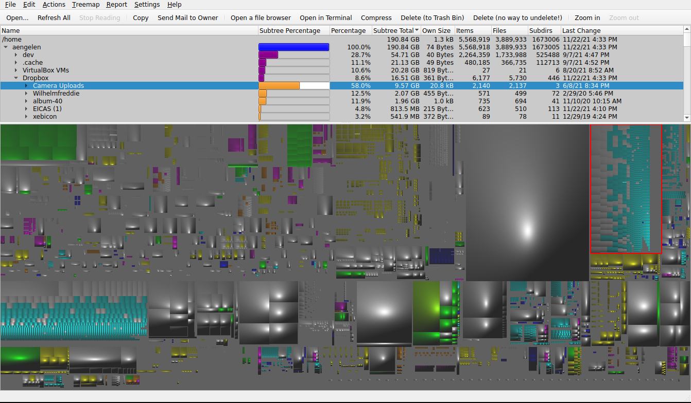

# Overview



See the [wiki](https://github.com/jeromerobert/k4dirstat/wiki/Overview).

# Building

First install [Qt 5](http://www.qt.io) and [KDE Framework 5](https://www.kde.org) headers. On Debian and its derivatives it can be done with:

```
apt-get install extra-cmake-modules qtbase5-dev libkf5coreaddons-dev \
 libkf5i18n-dev libkf5xmlgui-dev libkf5doctools-dev libkf5kio-dev
```

Then run [cmake](http://www.cmake.org):

    cmake -DCMAKE_INSTALL_PREFIX=/path/where/to/install
    make install
